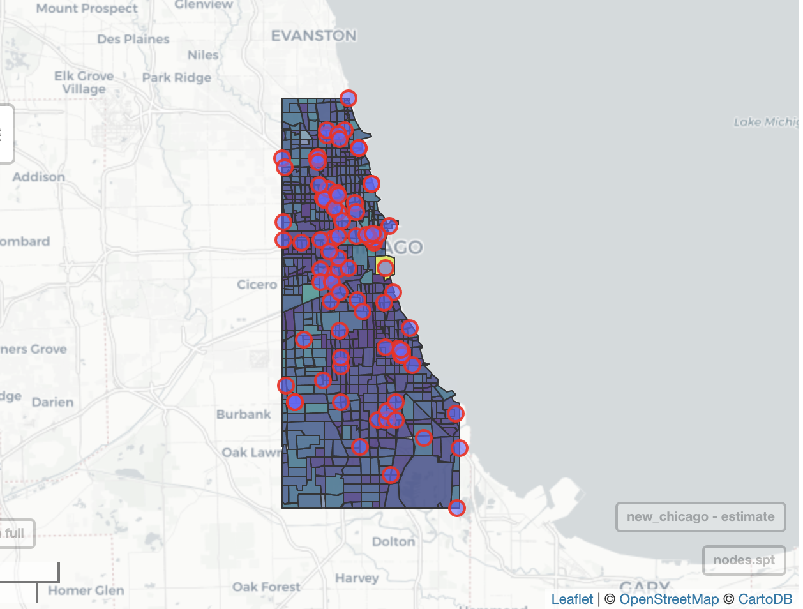

# Heatwave in the Neighborhood
This is an initial attempt to creat a model for predicting the ambient temperature in different parts of a neighborhood. This temperature is not available in such fine spatial scale for most of the urban areas, while considering the effect of Urban Heat Island (UHI) may lead into considerable changes in ambient temperature in very short distances.

  
   
  Census Block Groups of Chicago and the placement locations of [Array of Things](https://arrayofthings.github.io) sensors.

* More can be found [here](https://raw.githack.com/Babakjfard/HeatInNeighborhood/master/Heat_in_the_Neighborhood.html)